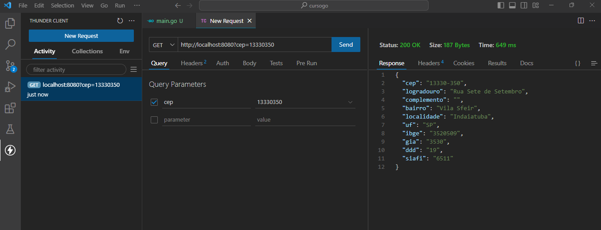
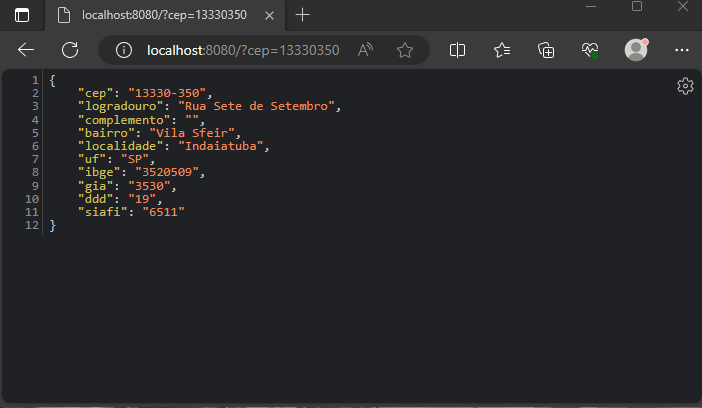

# Busca CEP em Go

##### Aplicação em Go que inicia um servidor http,  consome a api ViaCep decodificando e codificando um json e retornando a requisição do cep informado na barra de endereço na Query formato GET

# Pacotes utilizados:
                
 **"encoding/json"**
                 
 **"io"**
                 
 **"net/http"**

# Codificado:

- Go versão 1.21.4

# testes:

- thunder VSCODE

- Navegador                

  
 

